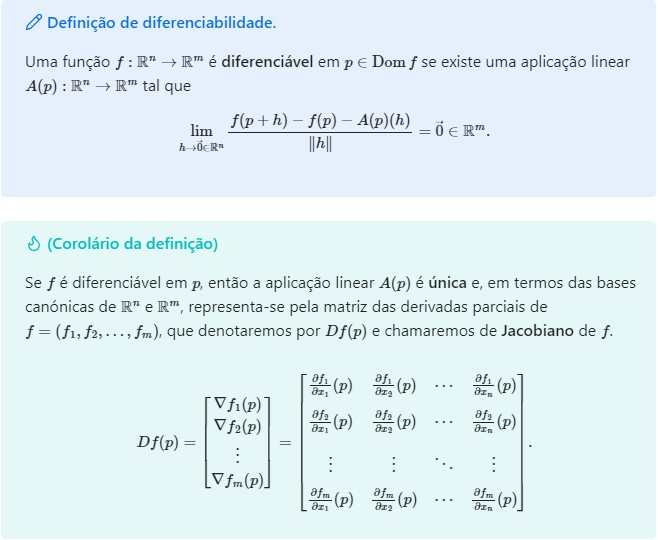

# 🗃️ Derivadas direcionais

Seja $$f:\mathbb{R}^2\to\mathbb{R}$$. Pensemos agora no **ponto** $$(a,b)\in\operatorname{Dom}f$$ como o **vetor posição** $$p=(a,b)$$ e consideremos o vetor $$\vec{e}_1=(1,0)$$, na **direção** do eixo **X**, e o vetor $$\vec{e}_2=(0,1)$$, na **direção** do eixo **Y**. Podemos reescrever a definição das derivadas parciais de $$f$$no ponto $$(a,b)$$com relação a $$x$$, e $$y$$, da seguinte forma

$$
\dfrac{\partial f}{\partial x}(p)=\displaystyle\lim_{h\to 0}\frac{f(p+h\vec{e}_1)-f(p)}{h}\qquad\text{e}\qquad\dfrac{\partial f}{\partial y}(p)=\lim_{h\to 0}\frac{f(p+h\vec{e}_2)-f(p)}{h}  .
$$


Os vetores $$\vec{e}_1$$e $$\vec{e}_2$$ **não** são as **únicas** direções que podemos considerar no plano XY. Temos um número **ilimitado** de direções no plano. Portanto, podemos **construir** a derivada de uma função em duas variáveis numa **direção qualquer**. Só precisamos ter o cuidado de tomar direções de [**norma**](#user-content-fn-1)[^1] igual a 1, tal como ocorre com $$\vec{e}_1$$e $$\vec{e}_2$$, para evitar ambiguidades.&#x20;


## Definição.&#x20;

A derivada direcional de $$f\colon\mathbb{R}^2\to\mathbb{R}$$ no ponto $$p=(a,b)\in\operatorname{Dom}f$$na direção do vetor (**unitário**) $$\vec{v}$$ é o número real dado por

$$
\dfrac{\partial f}{\partial\vec{v}}(p)=\lim_{h\to 0}\frac{f(p+h\vec{v})-f(p)}{h} .
$$

## Resultado teórico importante.

Se $$f$$ é [**diferenciável** ](#user-content-fn-2)[^2]em $$p$$, então

$$
\dfrac{\partial f}{\partial\vec{v}}(p)=\nabla f(p) \cdot \vec{v} \quad.
$$


Quando $$f$$ é diferenciável, a derivada direcional de $$f$$ no ponto $$p$$ na direção do vetor $$\vec{v}$$ é uma **combinação linear** das derivadas parciais de $$f$$. Note-se que se considerarmos qualquer vetor paralelo a $$\vec{v}$$, por exemplo, $$\vec{w}=\alpha\vec{v}$$, com $$\alpha\neq 0$$, teríamos que&#x20;

&#x20;                    $$\dfrac{\partial f}{\partial\vec{w}}(p)=\nabla f(p)\cdot\alpha\vec{v}=\alpha\nabla f(p)\cdot\vec{v}=\alpha\dfrac{\partial f}{\partial\vec{v}}(p)$$,

ou seja, a derivada direcional dependeria não apenas da direção, mas também do comprimento da direção! Para **evitar esta ambiguidade** e ter uma definição robusta compatível com o resultado teórico acima mencionado, usaremos só **vetores unitários** no cálculo da derivada direcional.&#x20;

> E se é pedido encontrar a derivada direcional em relação a uma direção não unitária?  :thinking:

Nesse caso, **normalizamos** primeiro o vetor e depois calculamos a derivada direcional.&#x20;



## O gradiente dá a direção de mais rápido crescimento

Suponhamos que nos encontramos no ponto $$p\in\operatorname{Dom}f$$.  Suponhamos que $$f$$ é **diferenciável** em $$p$$. Queremos saber qual é a direção que devemos tomar para aumentar (ou diminuir) o valor de $$f$$ o **mais depressa possível**. Por outras palavras, queremos encontrar a solução ao seguinte problema

$$
\max_{\Vert\vec{v}\Vert=1}\tfrac{\partial f}{\partial\vec{v}}(p) \quad\Longleftrightarrow \quad \max_{\Vert\vec{v}\Vert=1} \nabla f(p)\cdot\vec{v} \,.
$$

Como $$\nabla f(p)\cdot\vec{v}=\Vert\nabla f(p)\Vert\,\Vert\vec{v}\Vert\cos\theta = \Vert\nabla f(p)\Vert\cos\theta$$, o valor de $$f$$aumentará (ou diminuirá) mais depressa se o ângulo $$\theta=0$$, ou seja, quando $$\vec{v}$$ estiver na direção de $$\nabla f(p)$$. Neste caso, o **valor máximo** de $$\nabla f(p)\cdot \vec{v}$$ , com $$\vec{v}$$ tal que $$\Vert\vec{v}\Vert=1$$ é

$$
\max_{\Vert\vec{v}\Vert=1} \nabla f(p)\cdot\vec{v} =\nabla f(p)\cdot\frac{\nabla f(p)}{\Vert\nabla f(p)\Vert}=\frac{\Vert\nabla f(p)\Vert^{\cancel{2}}}{\cancel{\Vert\nabla f(p)\Vert}}=\Vert\nabla f(p)\Vert\,.
$$

## Aplicativo em [Geogebra](https://www.geogebra.org/)


Applet criado por Alfredo Sánchez Alberca


## Vídeo elucidativo&#x20;


Vídeo criado por Grant Sanderson


Exercício 17 d), Ficha I. 

&#x20;Calcule a derivada direcional de$$f(x,y)=y^2\ln x$$ no ponto $$P=(1,4)$$ e na direção do vetor de $$P$$ para $$Q=(-2,7)$$.

***

Primeiro, temos que $$\partial_x f =\frac{y^2}{x}$$  e $$\partial_y f = 2y\ln x$$. Logo, no ponto $$P$$, temos que $$\nabla f(p)=\left(\frac{y^2}{x}\Big|_{(1,4)},2y\ln x\Big|_{(1,4)}\right)=(16,0) .$$Segundo, o vetor de $$P$$ para $$Q$$ é $$\vec{v}=Q-P=(-2,7)-(1,4)=(-3,3)$$. Como não é unitário, normalizamos e obtemos o vetor&#x20;

&#x20;                               $$\vec{u}=\frac{(-3,3)}{\Vert(-3,3)\Vert}=\frac{1}{3\sqrt{2}}(-3,3)=\left(-\frac{\sqrt{2}}{2},\frac{\sqrt{2}}{2}\right)$$.

Desta forma, a derivada direcional requerida é

&#x20;                $$\dfrac{\partial f}{\partial\vec{v}}(P)=\nabla f(P)\cdot \vec{u}=(16,0)\cdot\left(-\frac{\sqrt{2}}{2},\frac{\sqrt{2}}{2}\right)=-8\sqrt{2}$$.

[^1]: A norma de $$\vec{v}=(v_1,v_2)$$é $$\Vert\vec{v}\Vert=\sqrt{v_1^2+v_2^2}$$.

[^2]: Na seguinte definição, fazer $$n=2$$ e $$m=1$$. 
