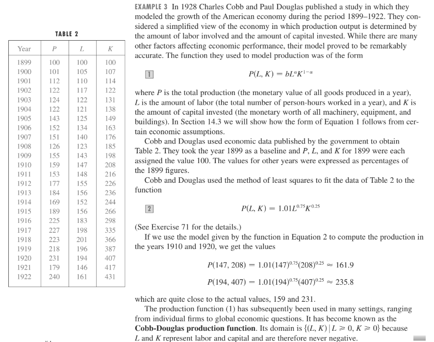

# 🗃️ Extremos condicionados

## Qual é o problema que vamos estudar?

Queremos maximizar ou minimizar (**otimizar**) uma função real em várias variáveis sujeita a (s.a.) **uma** **restrição** de igualdade. Para fixar ideias, a formulação matemática do **problema de otimização condicionada** para funções em **duas variáveis** é a seguinte

$$
\begin{matrix}\displaystyle\max_{(x,y)\in\operatorname{Dom}f}\,f(x,y) \\[2ex]\text{s.a.}\quad g(x,y)=b\end{matrix}\qquad\text{ou}\qquad\begin{matrix}\displaystyle\min_{(x,y)\in\operatorname{Dom}f}\,f(x,y) \\[2ex]\text{s.a.}\quad g(x,y)=b\end{matrix}
$$


&#x20;**Nomes.**

* $$f(x,y)$$: função **objetivo**.
* $$g(x,y)$$: função **restrição.**
* $$D=\big\{(x,y)\in\operatorname{Dom}f \,:\, g(x,y)=b\big\}$$: **região de factibilidade**.
* A **solução** do problema de otimização condicionada, isto é, por exemplo,$$(x^\ast,y^\ast)=\begin{matrix}\displaystyle\max_{(x,y)\in\operatorname{Dom}f}f(x,y) \\[2ex]\text{s.a.}\quad g(x,y)=b\end{matrix}$$ chama-se de **ponto máximo condicionado** de $$f$$.
* $$f(x^\ast,y^\ast)$$: **valor máximo condicionado** de $$f$$.


## Como resolvemos o problema?

ℹ️ Marco teórico importante.

Se $$g:\mathbb{R}^2\to\mathbb{R}$$ é uma função **contínua** no seu domínio, então o conjunto $$D$$ dos pontos $$(x,y)\in\operatorname{Dom}f$$ que satisfazem a **equação** $$g(x,y)=b$$ é um conjunto **fechado** em $$\mathbb{R}^2$$. Geometricamente, o conjunto $$D$$ é um **caminho** em $$\mathbb{R}^2$$ (uma especie de reta ou segmento de reta "curvado"), como por exemplo, uma parábola, uma elipse, um segmento de reta, et&#x63;**.** Neste sentido, a  região de factibilidade $$D$$ é un lugar geométrico de **dimensão** 1. Se, além disso, $$D$$ for **limitado**, então diremos que $$D$$ é um conjunto **compacto** em $$\mathbb{R}^2$$.  O teorema análogo ao [Teorema de Weierstrass](extremos-relativos-e-absolutos.md#teorema-analogo-ao-do-weierstrass-para-funcoes-numa-variavel) para funções em várias variáveis afirma que se $$f$$ é uma função contínua em $$D$$, então $$f$$ atinge os seus valores máximo e mínimo em $$D$$. Neste tópico iremos muitas vezes assumir, devido a possíveis interpretações em situações concretas (económicas por exemplo), que $$x\ge 0$$ e $$y\ge 0$$. Estas duas restrições de desigualdade junto com a restrição de igualdade fazem com que $$D$$ seja compacto, e, portanto, se conseguirmos encontrar pontos candidatos a solução (**pontos críticos**) de um problema de otimização condicionado, **bastará** com calcular os valores que a função objetivo toma nesses pontos  para logo escolher o **maior** deles como **valor máximo** e o **menor** como **valor mínimo**.

**Solução gráfica.**

No **caso de duas variáveis** podemos encontrar a solução gráficamente.

* Desenhe algumas curvas de nível da função objetivo $$f(x,y)$$ que intersectem a restrição $$g(x,y)=c$$ para ter uma ideia de como varia o valor de $$f$$.
* Desenhe a restrição $$g(x,y)=c$$ no plano XY.&#x20;
* Das curvas de nível de $$f$$ que intersectam a restrição $$g(x,y)=c$$, escolha aquela de maior valor (problema de maximização) ou a de menor valor (problema de minimização).

> :thinking: <mark style="color:purple;">Suponhamos que somos um desastre desenhando curvas, ou que elas não são assim tão simples de desenhar.  Há algum método sistemático  para encontrar a solução ótima nos problemas de otimização condicionada?</mark>
>
> Sim.

Antes de estudar tal forma, vejamos primeiro um par de situações.

### Restrição de igualdade linear, Função objetivo linear

Exemplo 1.

Uma companhia produce dois tipos de produtos: A e B. O lucro por unidade do produto A que a companhia deseja obter é de 10 euros, e por unidade do produto B, de 15 euros. A companhia tem um orçamento de 2000 euros para custos de produção. Sabendo que o custo de produzir uma unidade do produto A é de 5 euros, e para produzir uma unidade do produto B o custo é de 7 euros, quantas unidades de cada produto deve produzir a companhia de modo que maximize o lucro usando tudo o orçamento disponível?

***

**Formulação matemática:**&#x20;

* $$x$$: unidades produzidas de A,&#x20;
* $$y$$: unidades produzidas de B,&#x20;
* $$f(x,y)=10x+15y$$: objetivo (lucro),
* $$g(x,y)=5x+7y=2000$$: restrição (orçamental).

Queremos maximizar $$\left\{\begin{matrix}f(x,y)=10x+15y\\[2ex] \text{s.a.}\,\,5x+7y=2000\end{matrix}\right.$$.&#x20;

***

**Solução gráfica**:

Note-se que as curvas de nível de $$f$$ são retas. O ponto que maximiza o valor de $$f$$ ocorre na  interseção da restrição $$g(x,y)=c$$ com o eixo coordenado Y (como se pode observar no [aplicativo](extremos-condicionados.md#restricao-de-igualdade-linear-funcao-objetivo-linear) abaixo). Isto é assim porque, verifica-se que o valor da função objetivo cresce assim que subimos pelo gráfico da restrição, e, dado que não podemos continuar indefinidamente a subir, temos de parar na interseção com o eixo coordenado Y, pois intrínsecamente assumimos que tanto $$x$$ como $$y$$ devem ser não negativos (dado que não faz sentido produzir unidades negativas dos produtos A e B).&#x20;

**Solução analítica**:

A partir da restrição escrevemos $$y=-\frac{5}{7}x+\frac{2000}{7}$$ e substituimos na função objetivo para definir a função&#x20;

$$\tilde{f}(x)=f\big(x,-\frac{5}{7}x+\frac{2000}{7}\big)=10x+15\big(-\frac{5}{7}x+\frac{2000}{7}\big)=-\frac{5}{7}x+\frac{2000\times15}{7}$$.

O nosso problema é agora maximizar uma função unidimensional, e, como se trata de uma função "**linear**" com declive negativo, claramente, o máximo de $$\tilde{f}$$ é atingido na interseção com o eixo Y, ou seja, na fronteira, quando $$x^\ast=0$$, e portanto $$y^\ast=\frac{2000\times15}{7}=f(x^\ast,y^\ast).$$


&#x20;Região de factibilidade: segmento de reta a vermelho no primeiro quadrante. Função objetivo linear: os extremos ocorrem na **fronteira** da região de factibilidade.


> :information\_source: O problema de otimizar uma função objetivo linear sujeita a restrições lineares (de igualdade e desigualdade) é o teor da Programação Linear.

### Função objetivo não-linear

Exemplo 2.

O lucro pela produção de um determinado bem numa determinada empresa segue o modelo de Cobb-Douglas[^1]

&#x20;                                 $$\textcolor{blue}{f(x,y)=b\,x^{\alpha}y^{1-\alpha}}$$,

onde $$\bm{x}$$ representa horas de trabalho, $$\bm{y}$$ o capital investido, e $$\bm{b}$$ o fator de produtividade (ou preço da produção, que se assume diferente de zero). O parâmetro $$0<\alpha<1$$, representa a elasticidade da produção em relação ao trabalho e ao capital. A empresa deseja **maximizar** **o lucro** sujeito à  **restrição orçamental**&#x20;

&#x20;                                 $$\textcolor{red}{\mathsf{orc}=g(x,y)=T x + K y}$$,&#x20;

onde $$T$$ representa o custo do trabalho, e $$K$$, o custo do capital investidos.

***

Olhando para as curvas de nível de $$f$$ (experimente com o aplicativo abaixo), verifica-se que a função objetivo é **maximizada** quando a curva de nível é **tangente** à curva de restrição orçamental.

:thinking: <mark style="color:purple;">Digamos que o ponto de tangência é</mark> $$\textcolor{blue}{p=(x_c,y_c)}$$<mark style="color:purple;">. Como o encontramos?</mark>&#x20;

A observação chave é que **no ponto de tangência**, o gradiente de $$f$$ é **paralelo** ao gradiente de $$g$$ em forma **não trivial**, isto é

&#x20;                       $$\colorbox{yellow}{$\nabla f(p)=\lambda\nabla g(p)$}$$, para algum $$\lambda\in\mathbb{R}\setminus\{0\}$$.

Ou seja, &#x20;

$$\begin{matrix}f_x(x_c,y_c) &=& \lambda\, g_x(x_c,y_c)\\[2ex] f_y(x_c,y_c) &=& \lambda\, g_y(x_c,y_c)\end{matrix}\qquad\Longleftrightarrow\qquad\begin{matrix}\alpha b\, x_c^{\alpha-1}y_c^{1-\alpha} &=& \lambda\, T\\[2ex] (1-\alpha) b \,x_c^{\alpha}y_c^{-\alpha} &=& \lambda\,K\end{matrix}$$

Como $$\lambda\neq 0$$, temos que $$x_c\neq 0$$ e $$y_c\neq 0$$, e então podemos escrever

&#x20;                              $$\dfrac{\alpha \cancel{b}\, x_c^{\alpha-1}y_c^{1-\alpha}}{(1-\alpha)\cancel{b}\, x_c^\alpha y_c^{-\alpha}}=\dfrac{T}{K}\quad\Longrightarrow\quad y_c=\dfrac{(1-\alpha)T}{\alpha K}x_c$$.

Como $$(x_c,y_c)\in D$$ (a região de factibilidade), por definição deve satisfazer a restrição orçamental, e então

&#x20;                    $$\mathsf{orc}=Tx_c+Ky_c=Tx_c+K\frac{(1-\alpha)T}{\alpha K}x_c\quad\Longrightarrow\quad x_c=\dfrac{\alpha\,\mathsf{orc}}{T}$$.

Logo, o ponto de tangência é&#x20;

&#x20;                                           $$\colorbox{yellow}{$(x_c,y_c)=\Big(\frac{\alpha\,\mathsf{orc}}{T},\frac{(1-\alpha)\,\mathsf{orc}}{K}\Big)$}.$$

:thinking: <mark style="color:purple;">Tudo isto é muito bonito, mas como sabemos se efetivamente é a solução do problema de otimização condicionada? Por outras palavras, como sabemos se é um ponto máximo da função objetivo? Podia ser um ponto mínimo, ou nenhum deles? Qual é o critério que nos permite saber se o ponto encontrado é um máximo ou um mínimo?</mark>

Note-se que encontramos o ponto $$(x_c,y_c)$$ resolvendo uma **condição de tangência** que graficamente se verifica para um ponto extremo da função objetivo, ou seja, usando uma **condição necessária:** se sabemos a priori que $$p$$ é um ponto extremo restringido de $$f$$ (sujeita à uma restrição), então os gradientes da função objetivo e da função restrição em $$p$$ são paralelos.&#x20;

:thinking: <mark style="color:purple;">Uhmm! ponto de tangência...isto cheira a ponto crítico, como no caso da otimização irrestrita. Ah! então?, existe algo parecido neste contexto ao critério das segundas derivadas da otimização irrestrita?</mark>

Sim, existe! Veremos isto mais adiante. A ideia é construir uma nova função (a função de Lagrange ou **Lagrangeano**) com mais uma variável, $$\bm{\lambda}$$ (**multiplicador de Lagrange**), a partir da função objetivo e da função restrição. Desta maneira, um problema de otimização restrita em $$\mathbb{R}^2$$ torna-se num problema de otimização irrestrita em $$\mathbb{R}^3$$. O ponto de tangência encontrado anteriormente é parte do **ponto crítico** $$(x_c.y_c,\lambda_c)$$ do Lagrangeano, &#x65;**,** neste context&#x6F;**,** o **Hessiano do Lagrangeano** no ponto $$(x_c.y_c,\lambda_c)$$ dará a informação que nos falta para determinar se o ponto crítico $$(x_c,y_c)$$ é um máximo ou um mínimo da função $$f(x,y)$$ sujeita à restrição $$g(x,y)=\mathsf{orc}$$.

Para terminar, emulando o [Exemplo 1](extremos-condicionados.md#exemplo-1), da restrição $$\textcolor{red}{\mathsf{orc}=T x + K y}$$, segue-se que  $$y=-\frac{T}{K}x+\frac{\mathsf{orc}}{K}$$. Substituimos na função objetivo $$\textcolor{blue}{f(x,y)=b\,x^{\alpha}y^{1-\alpha}}$$ e definimos a função $$\widetilde{f}:\mathbb{R}\to\mathbb{R}$$ pela expressão $$\widetilde{f}(x)=b\,x^\alpha\Big(\frac{\mathsf{orc}}{K}-\frac{T}{K}x\Big)^{1-\alpha}$$. Logo, o nosso problema  original de otimização condicionada é **equivalente** a um problema de otimização em $$\mathbb{R}$$. Deixo os detalhes ao leitor.


Função objetivo não linear. Os extremos da função objetivo ocorrem no **interior** da região de factibilidade (o segmento de reta a vermelho no primeiro quadrante).


## Função de Lagrange

Até agora temos estado a trabalhar com funções em $$\mathbb{R}^2$$. Para perceber melhor as definições e resultados seguintes,  consideremos agora funções em mais do que duas variáveis. Por exemplo, suponhamos que queremos resolver o seguinte problema

$$
\begin{matrix}\displaystyle\max_{(w,x,y,z)\in\operatorname{Dom}f\subset\mathbb{R}^4}\,f(w,x,y,z) \\[2ex]\text{s.a.}\quad g(w,x,y,z)=b_1 \\ \,\,\qquad h(w,x,y,z)=b_2\end{matrix}
$$

Para fixar ideias, digamos que (o seguinte exemplo é retirado de [https://www.math.cmu.edu/\~hanifc/NotesOnHessians.pdf](https://www.math.cmu.edu/~hanifc/NotesOnHessians.pdf))

$$
\begin{array}{lcl} f(w,x,y,z) &=& -w^2-x^2-y^2-z^2 \\ \qquad\small\mathsf{e} \\ g_1(w,x,y,z) &=& 4w-3y+z=-15\\
g_2(w,x,y,z) &=& -2x-y+z=-5\end{array}
$$

A **função de Lagrange** (ou **Lagrangeano**) associada ao nosso problema é

$$
\mathcal{L}(\lambda_1,\lambda_2;w,x,y,z)=f(w,x,y,z)-\lambda_1\big(g_1(w,x,y,z)-b_1\big)-\lambda_2\big(g_2(w,x,y,z)-b_2\big).
$$


:mag\_right: <mark style="color:red;">Note-se</mark> que $$\mathcal{L}:\mathbb{R}^6\to\mathbb{R}$$, enquanto que $$f,g_1,g_2: \mathbb{R}^4\to\mathbb{R}$$. Repare-se ainda que $$\mathcal{L}$$ é irrestrita (incorporou as restrições $$g_1=b_1$$ e $$g_2=b_2$$ na sua construção). A ideia é  **maximizar** $$\mathcal{L}$$ para que a partir de ai, consigamos de [alguma forma](#user-content-fn-2)[^2] maximizar $$f$$ sujeita às restrições dadas.


Sejam $$\bm{\lambda}=(\lambda_1,\lambda_2)$$ e $$\bm{p}=(w,x,y,z)$$. Recordemos que $$(\bm{\lambda},\bm{p})$$ é um **ponto crítico** de $$\mathcal{L}$$  se $$\nabla\mathcal{L}(\bm{\lambda},\bm{p})=\vec{0}$$. Deste modo, para encontrar os pontos críticos de $$\mathcal{L}$$, temos de resolver o seguinte sistema de equações

$$
\small\colorbox{yellow}{$\nabla\mathcal{L}(\lambda,p)=\vec{0}$}\,\Longleftrightarrow\,\begin{bmatrix}\mathcal{L}_{\lambda_1}(\lambda,p) \\ \mathcal{L}_{\lambda_2}(\lambda,p) \\ \mathcal{L}_w(\lambda,p) \\ \mathcal{L}_x(\lambda,p) \\ \mathcal{L}_y(\lambda,p) \\ \mathcal{L}_z(\lambda,p)\end{bmatrix}=\begin{bmatrix}0\\0\\0\\0\\0\\0\end{bmatrix}\,\Longleftrightarrow\,\begin{bmatrix}b_1-g_1(p)\\b_2-g_2(p)\\f_w(p)-\lambda_1{g_1}_w(p)-\lambda_2{g_2}_w(p) \\ f_x(p)-\lambda_1{g_1}_x(p)-\lambda_2{g_2}_x(p) \\ f_y(p)-\lambda_1{g_1}_y(p)-\lambda_2{g_2}_y(p) \\ f_z(p)-\lambda_1{g_1}_z(p)-\lambda_2{g_2}_z(p)\end{bmatrix}=\begin{bmatrix}0\\0\\0\\0\\0\\0\end{bmatrix} .
$$

As duas primeiras equações são as restrições de igualdade dadas,&#x20;

$$
\colorbox{yellow}{$g_1(p)=b_1$}\qquad\mathsf{e}\qquad \colorbox{yellow}{$g_2(p)=b_2$} .
$$

As restantes equações são equivalentes a dizer que o vetor $$\nabla f(p)$$ pode ser exprimido como uma **combinação linear** dos vetores $$\nabla g_1(p)$$ e $$\nabla g_2(p)$$,

$$
\colorbox{yellow}{$\nabla f(p) = \lambda_1\nabla g_1(p) + \lambda_2\nabla g_2(p) $}.
$$

Se os vetores  $$\nabla g_1(p)$$ e $$\nabla g_2(p)$$ são **linearmente independentes**, então tal combinação linear é **única.** Esta é a **generalização da condição de tangência** que vimos no [Exemplo 2](extremos-condicionados.md#exemplo-2). Portanto, se $$(\bm{\lambda},\bm{p})$$ é um ponto crítico do Lagrangeano $$\mathcal{L}$$, então $$\bm{p}$$ é um **ponto crítico condicionado** ("ponto de tangência") de $$f$$, e viceversa.&#x20;


Nos problemas que nos interessam, usualmente esta condição de independência linear é satisfeita.


No caso particular das funções $$f, g_1, g_2$$ dadas, obtemos o seguinte sistema de equações

$$
\begin{array}{lcl}
\mathcal{L}_{\lambda_1}=-15 - 4w + 3y - z &=& 0 \\
\mathcal{L}_{\lambda_2}=-5 + 2x +y - z &=& 0 \\
\mathcal{L}_{w}=-2w - 4\lambda_1 &=& 0 \\
\mathcal{L}_{x}=-2x + 2\lambda_2 &=& 0 \\
\mathcal{L}_{y}=-2y + 3\lambda_1 + \lambda_2 &=& 0\\
\mathcal{L}_{z}=-2z - \lambda_1 - \lambda_2 &=& 0
\end{array}
$$


:mag\_right:  <mark style="color:red;">Note-se</mark> que neste caso particular temos um sistema de equações lineares com $$6$$ incógnitas. Refrescando os nossos conhecimentos de Matemática I, podemos usar, por exemplo, o algoritmo de Gauss para o resolver. Verifique que a solução é  $$(\bm{\lambda,p})=(\lambda_1,\lambda_2,w,x,y,z)=\colorbox{yellow}{$(-1,-1,2,-1,-2,1)$}$$.


## Matriz Hessiana orlada

Calculemos agora a **matriz Hessiana do Lagrangeano**. Ela é dada por

$$
\mathcal{H}_{\mathcal{L}}=\begin{bmatrix}\mathcal{L}_{\lambda_1\lambda_1} & \mathcal{L}_{\lambda_1\lambda_2} & \mathcal{L}_{\lambda_1w} & \mathcal{L}_{\lambda_1x} & \mathcal{L}_{\lambda_1y} & \mathcal{L}_{\lambda_1z} \\ \mathcal{L}_{\lambda_2\lambda_1} & \mathcal{L}_{\lambda_2\lambda_2} & \mathcal{L}_{\lambda_2w} & \mathcal{L}_{\lambda_2x} & \mathcal{L}_{\lambda_2y} & \mathcal{L}_{\lambda_2z} \\ \mathcal{L}_{w\lambda_1} & \mathcal{L}_{w\lambda_2} & \mathcal{L}_{ww} & \mathcal{L}_{wx} & \mathcal{L}_{wy} & \mathcal{L}_{wz} \\ \mathcal{L}_{x\lambda_1} & \mathcal{L}_{x\lambda_2} & \mathcal{L}_{xw} & \mathcal{L}_{xx} & \mathcal{L}_{xy} & \mathcal{L}_{xz} \\ \mathcal{L}_{y\lambda_1} & \mathcal{L}_{y\lambda_2} & \mathcal{L}_{yw} & \mathcal{L}_{yx} & \mathcal{L}_{yy} & \mathcal{L}_{yz} \\ \mathcal{L}_{z\lambda_1} & \mathcal{L}_{z\lambda_2} & \mathcal{L}_{zw} & \mathcal{L}_{zx} & \mathcal{L}_{zy} & \mathcal{L}_{zz}\end{bmatrix}
$$

$$
\mathcal{H}_{\mathcal{L}}=\begin{bmatrix}\colorbox{yellow}{0} & \colorbox{yellow}{0} & -{g_1}_w & -{g_1}_x & -{g_1}_y & -{g_1}_z \\ \colorbox{yellow}{0} & \colorbox{yellow}{0} & -{g_2}_w & -{g_2}_x & -{g_2}_y & -{g_2}_z \\ -{g_1}_w & -{g_2}_w & \colorbox{lightgreen}{$\mathcal{L}_{ww}$} & \colorbox{lightgreen}{$\mathcal{L}_{wx}$} & \colorbox{lightgreen}{$\mathcal{L}_{wy}$} & \colorbox{lightgreen}{$\mathcal{L}_{wz}$} \\ -{g_1}_x & -{g_2}_x & \colorbox{lightgreen}{$\mathcal{L}_{xw}$} & \colorbox{lightgreen}{$\mathcal{L}_{xx}$} & \colorbox{lightgreen}{$\mathcal{L}_{xy}$} & \colorbox{lightgreen}{$\mathcal{L}_{xz}$} \\ -{g_1}_y & -{g_2}_y & \colorbox{lightgreen}{$\mathcal{L}_{yw}$} & \colorbox{lightgreen}{$\mathcal{L}_{yx}$} & \colorbox{lightgreen}{$\mathcal{L}_{yy}$} & \colorbox{lightgreen}{$\mathcal{L}_{yz}$} \\ -{g_1}_z & -{g_2}_z & \colorbox{lightgreen}{$\mathcal{L}_{zw}$} & \colorbox{lightgreen}{$\mathcal{L}_{zx}$} & \colorbox{lightgreen}{$\mathcal{L}_{zy}$} & \colorbox{lightgreen}{$\mathcal{L}_{zz}$}\end{bmatrix}
$$


:mag\_right: <mark style="color:red;">Note-se</mark> a estrutura do Hessiano do Lagrangeano mostrado acima. É uma matriz de tamanho $$\bm{n+m=6}$$, com $$\bm{n}$$ igual ao número de variáveis de $$f$$  (neste caso $$\bm{n=4}$$), e $$\bm{m}$$ igual ao número de restrições (neste caso $$\bm{m=2}$$). No canto superior esquerdo de $$\mathcal{H}_{\mathcal{L}}$$, temos um **bloco de zeros** de tamanho $$\bm{m}$$, e, a seguir o bloco, as $$\bm{m}$$ **primeiras** **linhas e colunas** de $$\mathcal{H}_{\mathcal{L}}$$ contêm as **derivadas das restrições.** Além disso, observamos também um **bloco** de tamanho $$\bm{n}$$ com as **segundas derivadas de** $$\bm{\mathcal{L}}$$ em relação às variáveis de $$f$$. Agora, fazendo $$\bm{g}=(g_1,\cdots,g_m)$$, denotando por $$\bm{0}$$ a matriz de zeros de tamanho $$\bm{m}$$, escrevendo $$\bm{\nabla g = \begin{bmatrix}\nabla g_1 \\ \vdots\\ \nabla g_m\end{bmatrix}}$$, e finalmente, denotando por $$\bm{x}$$ as variáveis de $$f$$ (no exemplo dado, $$\bm{x}=(w,x,y,z)$$), podemos escrever o Hessiano $$\mathcal{H}_{\mathcal{L}}$$ de maneira mais compacta da forma seguinte

$$\mathcal{H}_{\mathcal{L}}=\begin{bmatrix}\bm{0} & \bm{-\nabla g} \\[2ex] (\bm{-\nabla g})^T & \bm{\dfrac{\partial^2\mathcal{L}}{\partial x^2}}\end{bmatrix}$$. O **Hessiano** $$\bm{\mathcal{H}_{\mathcal{L}}}$$ recebe o nome de **Hessiano orlado**, devido ao que acontece nas **margens** superior e esquerda da matriz.


No caso particular do exemplo, temos

$$
\mathcal{H}_{\mathcal{L}}=\begin{bmatrix}\colorbox{yellow}{0} & \colorbox{yellow}{0} & -4 & 0 & 3 & -1 \\ \colorbox{yellow}{0} & \colorbox{yellow}{0} & 0 & 2 & 1 & -1 \\ -4 & 0 & \colorbox{lightgreen}{-2} & \colorbox{lightgreen}{0} & \colorbox{lightgreen}{0} & \colorbox{lightgreen}{0} \\ 0 & 2 & \colorbox{lightgreen}{0} & \colorbox{lightgreen}{-2} & \colorbox{lightgreen}{0} & \colorbox{lightgreen}{0} \\ 3 & 1 & \colorbox{lightgreen}{0} & \colorbox{lightgreen}{0} & \colorbox{lightgreen}{-2} & \colorbox{lightgreen}{0} \\ -1 & -1 & \colorbox{lightgreen}{0} & \colorbox{lightgreen}{0} & \colorbox{lightgreen}{0} & \colorbox{lightgreen}{-2}\end{bmatrix}
$$

Repare-se que neste caso particular, o Hessiano $$\mathcal{H}_{\mathcal{L}}$$ é uma matriz constante, não depende das coordenadas do ponto crítico $$\bm{(\lambda,p)}$$. Contudo, não se deve esquecer que <mark style="color:red;">**primeiro calculamos a matriz Hessiana de forma geral, e depois a avaliamos no ponto crítico encontrado.**</mark> Procedemos desta forma  porque a ideia é determinar a **natureza do ponto crítico** analizando a natureza da matriz resultante. No geral, o Hessiano $$\mathcal{H}_{\mathcal{L}}{\small(\lambda,p)}$$ irá depender das coordenadas do ponto crítico $$(\lambda,p)$$.


Recordemos que os pontos extremos de uma função sem restrições, são caracterizados (entre os pontos críticos com matriz Hessiana não singular) pelos **sinais** dos **menores principais líderes**, os quais determinam se a matriz Hessiana é **definida positiva** (e então o ponto crítico é um **mínimo**) ou definida negativa (e então o ponto crítico é um **máximo**). No caso do Hessiano orlado, não há forma que seja quer definida positiva quer definida negativa. Isto se deve ao bloco de zeros que necessariamente aparece nesta matriz. Porém, existe um [resultado](extremos-condicionados.md#condicao-suficiente-para-pontos-extremos) que contorna este problema.


## Condição suficiente para extremos condicionados

Denotemos por $$B_r(\lambda,p)$$ o $$(m+r)$$-ésimo menor principal líder de $$\mathcal{H}_{\mathcal{L}}(\lambda,p)$$. Assumamos que $$\bm{(\lambda,p)}$$ é um ponto crítico de $$\mathcal{L}:\mathbb{R}^m\times\mathbb{R}^n\to\mathbb{R}$$. Suponhamos que tanto a função objetivo $$f:\mathbb{R}^n\to\mathbb{R}$$ como as funções de restrição $$g_1,\ldots,g_m:\mathbb{R}^n\to\mathbb{R}$$ são de classe $$C^2$$ no domínio comum a todas elas. E por último, suponhamos que os vetores $$\{\nabla g_1(\bm{p}),\ldots,\nabla g_m(\bm{p})\}$$são linearmente independentes. Então

* Se $$(-1)^rB_r(\bm{\lambda,p})>0,\forall\,r=m+1,\ldots, n\implies \bm{p}$$ é um **máximo local** condicionado de $$f$$.
* Se $$(-1)^mB_r(\bm{\lambda,p})>0,\,\forall\,r=m+1,\ldots, n\implies \bm{p}$$ é um **mínimo local** condicionado de $$f$$.


Portanto, para determinar se um ponto crítico $$\bm{p}$$ é um extremo condicionado local de $$f$$,  temos de olhar para os sinais dos **últimos** $$\bm{n-m}$$ **menores principais líderes do Hessiano orlado** $$\mathcal{H}_{\mathcal{L}}(\bm{\lambda,p})$$.&#x20;


No problema de otimização original temos **4 variáveis**, e **2 restrições**:  $$\boxed{n=4, m=2, r=3,4}$$. Logo,&#x20;

$$
\scriptsize B_3(\lambda,p)=\begin{vmatrix*}[r] 0 & \phantom{-}0 & -4 & 0 & 3 \\ 0 & 0 & 0 & 2 & 1 \\ -4 & 0 & -2 & 0 & 0 \\ 0 & 2 & 0 & -2 & 0 \\ 3 & 1 & 0 & 0 & -2\end{vmatrix*}_{\tiny 5\times 5}=-232\quad,\quad B_4(\lambda,p)=\begin{vmatrix*}[r]{0} & {0} & -4 & 0 & 3 & -1 \\ {0} & {0} & 0 & 2 & 1 & -1 \\ -4 & 0 & {-2} & {0} & {0} & {0} \\ 0 & 2 & {0} & {-2} & {0} & {0} \\ 3 & 1 & {0} & {0} & {-2} & {0} \\ -1 & -1 & {0} & {0} & {0} & {-2}\end{vmatrix*}_{\tiny 6\times 6}=560
$$

* $$(-1)^rB_r:$$   $$(-1)^3B_3$$ $$\colorbox{lightgreen}{$>0$}$$,  $$(-1)^4B_4$$ $$\colorbox{lightgreen}{$>0$}$$  condição satisfeita. :thumbsup:
* $$(-1)^mB_r:$$   $$(-1)^2B_3$$ $$\colorbox{#F1AFA0}{$<0$}$$,   $$(-1)^2B_4$$ $$\colorbox{lightgreen}{$>0$}$$  condição **não** satisfeita. :thumbsdown:

$$\boxed{\textsf{\textbf{Conclusão:}}}$$ O ponto $$\bm{p}=(2,-1,-2,1)$$ é um **ponto máximo** condicionado local de $$f$$.

## Vídeo elucidativo


Vídeo criado por Grant Sanderson


[^1]: 

[^2]: calma! já veremos de que forma
